# mini_project_202606
### RAG LLM
- 참고 github : https://github.com/skqorrla/GDG-HandsOn
- 2026.05.09 Build with AI Hands-on Campus 참여 후 개인 응용 실습
- 뉴스 기사를 수집해서 stm, ltm 으로 만들고 로컬 chromadb에 적재
- 유가 데이터를 tool 함수로 호출해서 뉴스 기반으로 유가 데이터 분석...을 원했는데 쉽지 않네...
 

## 보완점
- 2026.07.07
    - chromadb에 적재할 때 metadata에 기사 날짜 정보를 넣어줘야함
    - 사용자 질문을 분석하고 임베딩을 해야하는데 그런 단계가 없음

# 아키텍처
(vscode 미리보기랑 github 이랑 왜 다르지...)

```mermaid
flowchart RL
    A5 -.저장된 벡터 사용.-> SS
    subgraph DI ["Document Ingestion (뉴스 기사 적재)"]
        direction TB
        A1[Raw Documents]@{ shape: proc }
        A2[Text Preprocessing]@{ shape: proc }
        A3[STM to LTM]@{ shape: proc }
        A4[Generate Embeddings]@{ shape: proc }
        A5[Store in ChromaDB]@{ shape: proc }
        A1 --> A2 --> A3 --> A4 --> A5
    end
    subgraph Runtime ["Runtime (사용자 질문 입력)"]
      direction TB
      Q[User Question]@{ shape: proc }
      subgraph RAGFlow ["RAG"]
          direction TB
          QE[Generate Query Embedding]
          SS[Similarity Search]
          TK[Retrieve Top K Documents]
          QE --> SS --> TK
      end
        Q --> QE

        TK --> BC[Build Context<br/> + 질문 결합]
        BC --> PE[Prompt Engineering]
        PE --> G1[Gemini Call<br/>+ Tools Function]

        G1 -->|유가 데이터 분석 관련 질문 O| T2[select_oil_price 실행]
        G1 -->|유가 데이터 분석 관련 질문 X| G3[Gemini 최종 응답 생성]

        subgraph T2B ["Tool 내부"]
            direction TB
            T2 --> RP["CSV (추후 PostgreSQL 적용)"]
        end

        RP --> FR[function_response 반환]
        FR --> G3

        G3 --> RES[Final Response]


    end

```

